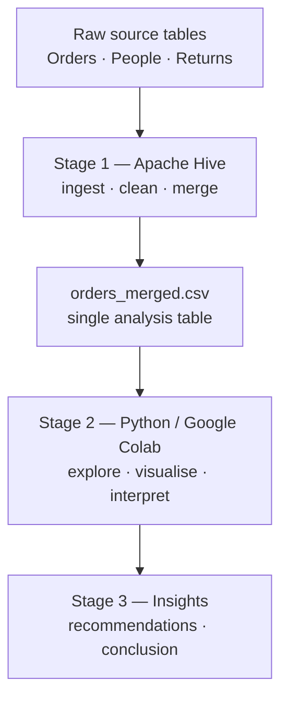

# Superstore Sales — Data Management & Analytics Project

A complete, end-to-end data pipeline that takes a raw retail dataset from three separate
source tables all the way to an executive dashboard. The project ingests and cleans the
data in **Apache Hive**, analyses and visualises it in **Python (Google Colab)**, and
presents the findings for decision-makers.

---

 👆 Click link to open the live, interactive report.
---

## 1. Report Details & Problem Statement

The goal is to turn four years of messy, multi-table transactional data into clear,
decision-ready insight. The project follows
the full data-management lifecycle a working data scientist would use:

1. **Manage the data** — bring three raw tables together, clean them, and produce one
   reliable analysis table.
2. **Explore and explain** — visualise sales, profit, discounting, returns and geography,
   with an interpretation and discussion for every chart.
3. **Decide** — distil the analysis into insights, recommendations and a board-level
   dashboard.

The headline finding is that the business is healthy and growing, but a small amount of
**deep discounting silently destroys a large share of its profit** — a problem that is
controllable rather than a function of weak demand.

---

## 2. Data source

| | |
|---|---|
| **Dataset** | *Sample – Superstore* (Tableau Public sample data) |
| **Provider** | Tableau Public |
| **Link** | https://public.tableau.com/app/learn/sample-data |
| **Domain** | Transactional sales for a fictional US office-supplies superstore |
| **Period covered** | January 2023 – December 2026 (four complete years, as dated in this version) |
| **Grain** | One row per order *line item* (a single product within an order) |
| **Size after cleaning** | 10,194 rows × 28 columns |

The dataset arrives as **three related tables**, which is what makes it a genuine *data
management* exercise rather than a single-file analysis:

- **Orders** — the transaction line items (dates, customer, product, geography, `sales`,
  `quantity`, `discount`, `profit`).
- **People** — the regional manager responsible for each `region`.
- **Returns** — the `order_id`s that were returned.

These are joined into a single denormalised table during the pipeline (see Stage 1).

---

## 3. The pipeline

### Stage 1 — Ingestion, cleaning & merging (Apache Hive / HiveQL)
The three raw tables are loaded into Hive and combined with a HiveQL pipeline:

- **Clean** — parse dates into a consistent format, standardise types, and resolve
  engine-specific quirks (e.g. date handling via `UNIX_TIMESTAMP`, working around the
  absence of `NULLIF`, and authorisation set-up). Exports use a tab delimiter to avoid
  conflicts with the commas embedded in product names.
- **Merge** — join **Orders ⋈ Returns** on `order_id` to flag returned lines, and
  **Orders ⋈ People** on `region` to attach the responsible manager.
- **Output** — a single, denormalised, analysis-ready table:
  `orders_merged.csv` (no missing values, no duplicate line IDs).

### Stage 2 — Exploratory analysis & visualisation (Python, Google Colab)
The cleaned CSV is loaded with **pandas**, a few analytical fields are derived
(`is_returned`, `profit_margin`, `ship_days`, discount bands), and the data is visualised
with **matplotlib** and **seaborn**. Two layers of charts are produced:

- **Analyst-grade** (detailed, one question per chart): annual trend, monthly seasonality,
  category & sub-category profitability, region & segment performance, the discount–profit
  relationship, returns, manager performance, top states, and ship-mode mix.
- **Executive (C-suite)**: a profit bridge (waterfall chart), and a strategic
  growth–margin matrix.

Every chart is accompanied by an **interpretation** and a **discussion**

### Stage 3 — Insights, recommendations & conclusion
The analysis is distilled into written findings : the discount cliff, the Furniture profit
drag, the loss-making high-volume states, and the West-region returns paradox, followed by
prioritised recommendations and a conclusion.

---

## 4. What's in this repository

| Item | Description |
|---|---|
| `orders_merged.csv` | The cleaned, merged analysis table (output of Stage 1) |
| `DM_FinalReport.ipynb` | The Colab notebook: visualisations, interpretation, insights, recommendations, conclusion, references |
| `Superstore Dashboard.pbix` | Power BI Dashboard|
| `README.md` | Report overview |

---

## 5. Key findings

- **Growth is strong** — sales grew at a 14.7% CAGR (\$494k → \$746k), at a 12.6% overall
  margin.
- **Discounting beyond 20% destroys value** — margin is positive up to a 20% discount, then
  turns sharply negative; the ~14% of lines discounted ≥30% account for a −\$136k profit
  impact.
- **Furniture is the profit drag** (2.6% margin vs ~17% elsewhere), driven by a few
  loss-making, heavily-discounted lines rather than weak products.
- **The West paradox** — the best-margin, top-selling region also has roughly triple the
  return rate of every other region.
- **High sales ≠ high profit** — several of the largest states (e.g. Texas) are sold at a
  loss.

---

## 6. How to reproduce

1. **Cleaned data already provided** — `orders_merged.csv` is the Stage 1 output, so
   you can start at Stage 2 directly.
2. **Run the analysis** — open `DM_FinalReport.ipynb` in Google Colab (or Jupyter), upload
   the CSV, and run all cells. Requires `pandas`, `numpy`, `matplotlib`, `seaborn`.
3. **Power BI Dashboard** - open `Superstore.pbix` in Power BI Desktop, change the data source and refresh the dashboard
   Alternately, you may view the dasboard via link below
   

---

## 7. Tools & technologies

| Stage | Tool |
|---|---|
| Ingestion, cleaning, merging | Apache Hive (HiveQL) in HDFS |
| Analysis & visualisation | Python · pandas · NumPy · matplotlib · seaborn (Google Colab) |
| Source control / sharing | GitHub |
| Dashboard Dynamic Visualization | Power BI |

---

*Prepared as part of the Master of Science (Data Science & Analytics) programme. Full
citations for the dataset and software libraries are listed in the References section of
`STQD6324_FinalReport_P166248.ipynb`.*
